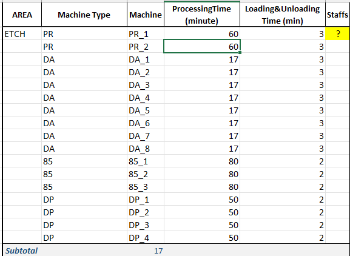
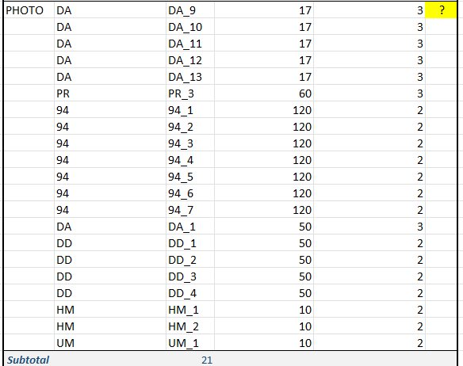
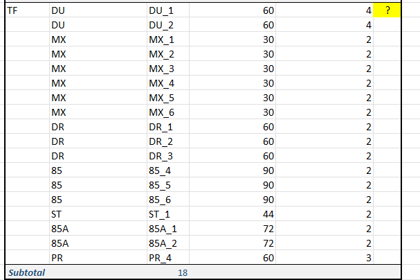

# Final project in simulation class

## Critiria

Determine the decisions of staff assignment and job dispatching to minimize total machine idle time

The objective is to minimize total machine idle time across multiple iterations.

Assumptions:

1. The simulation begins at time zero, with all machines initially idle and waiting for staff to load silicon wafers.
2. After a machine finishes processing, it becomes idle and waits for staff to load the next wafer.
3. Staff do not take breaks during the simulation.
4. Traveling time between machines can be ignored.

## circumstances

